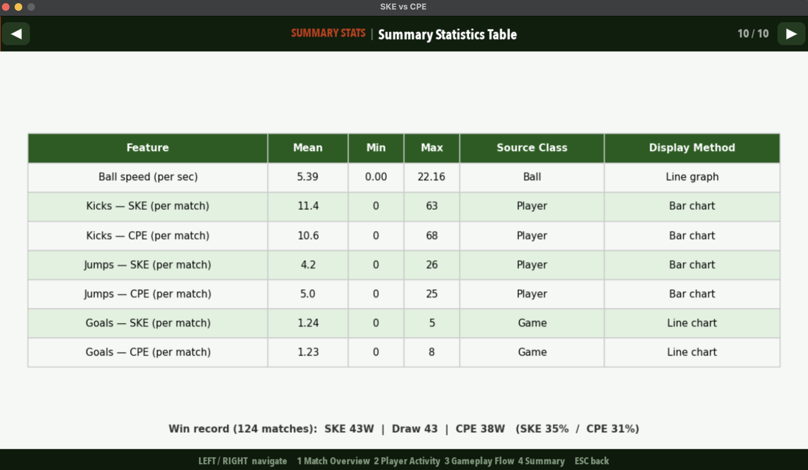
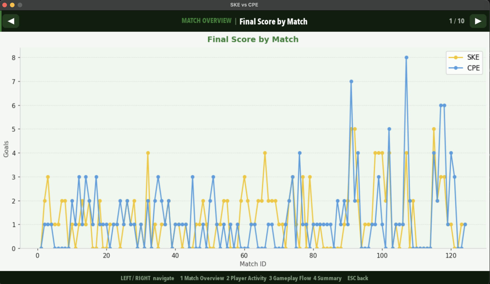
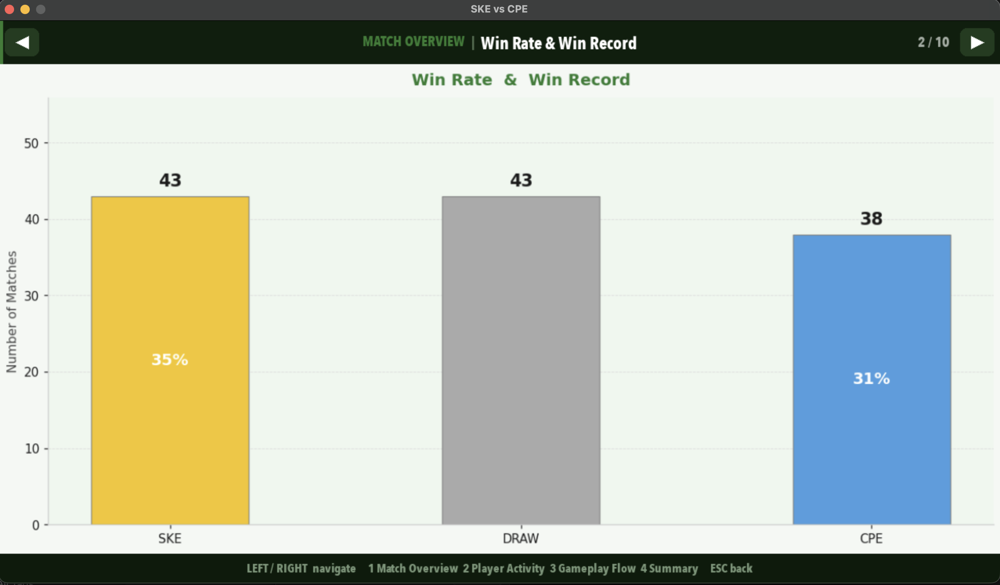
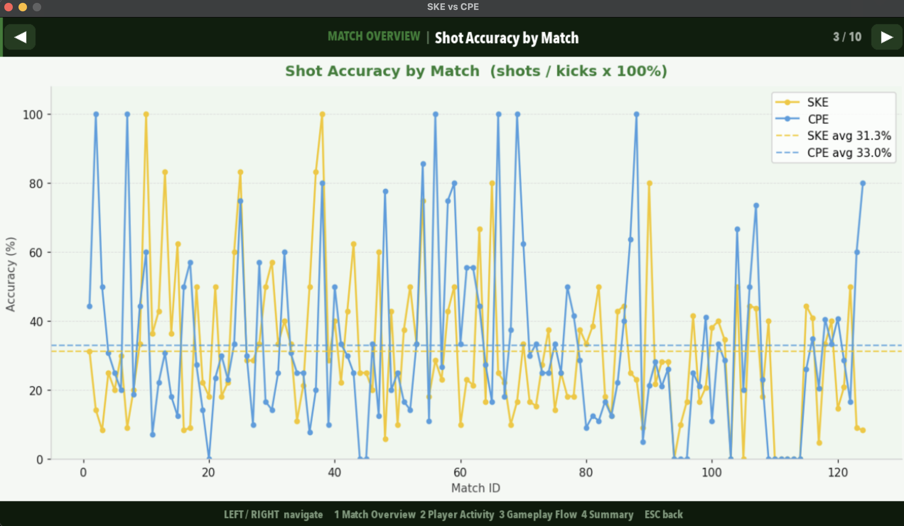
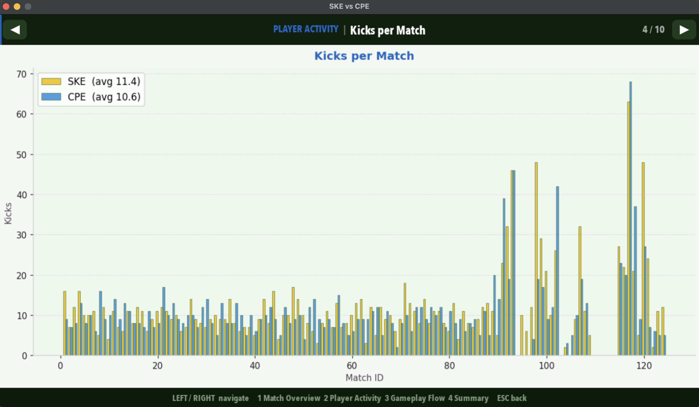
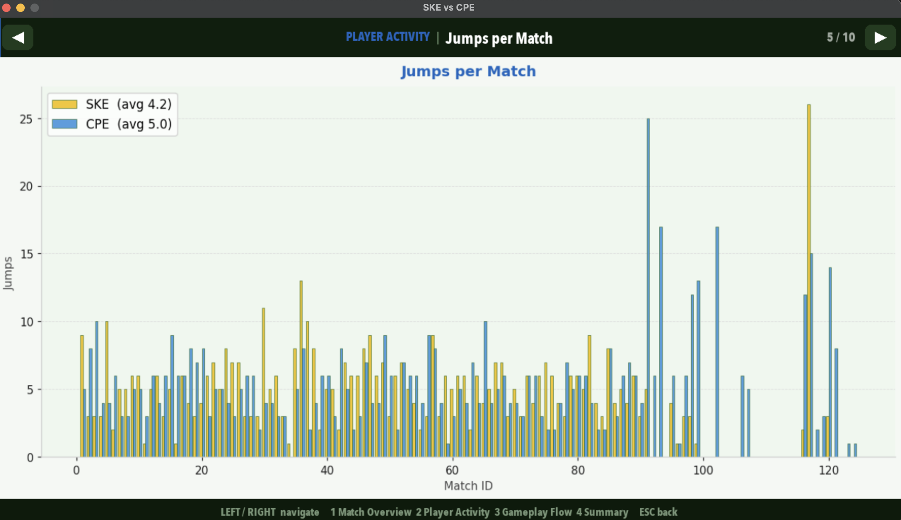
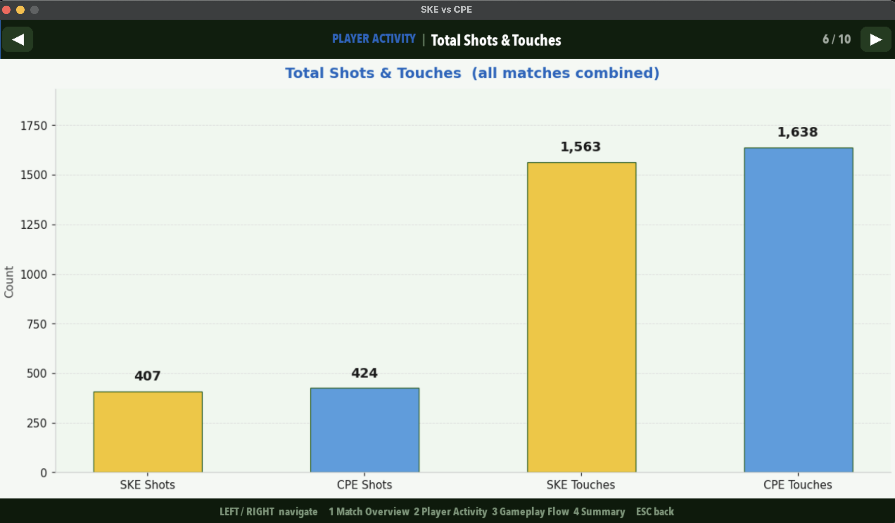
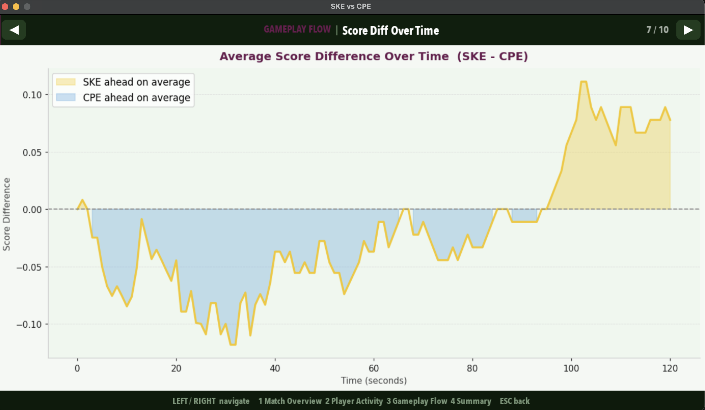
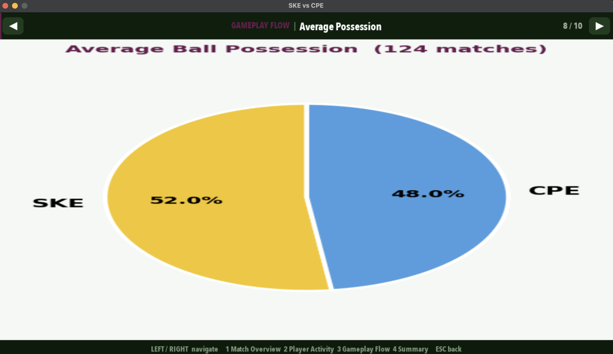
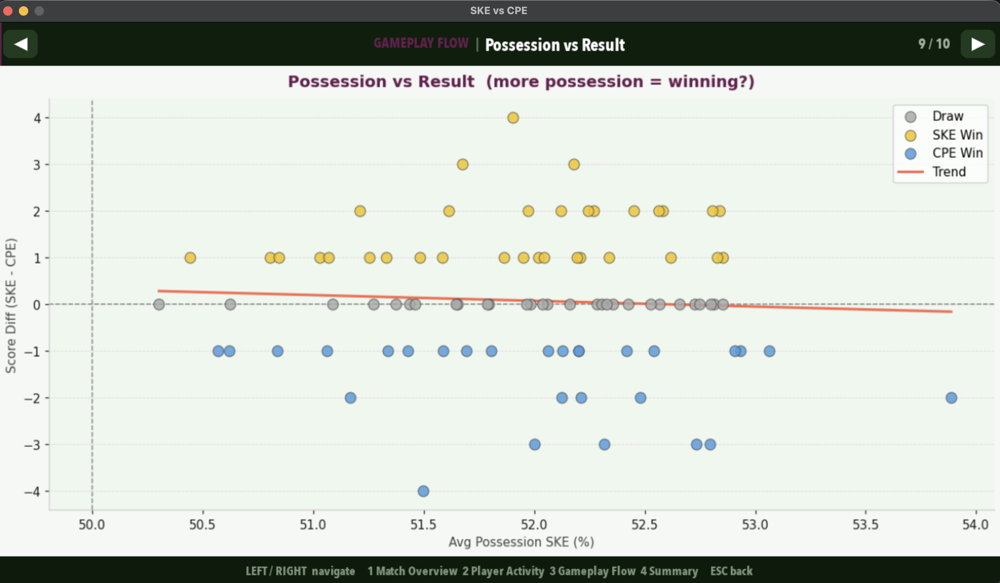

# Data Visualization

## Overview

The statistics dashboard is generated by running `data_analyze.py` after playing one or more matches.
It reads `game_data.csv` and produces a 9-panel PNG saved to `stats/stats_dashboard.png`.

---

## Summary Statistics Table

This summary statistics table presents the main gameplay features collected in the project, including ball speed, kicks, jumps, and goals. For each feature, it shows the mean, minimum, and maximum values across all recorded matches, along with the source class and the visualization method used in the dashboard.

---

## Panel Descriptions

### 1. Final Score by Match

Line chart showing SKE (yellow) and CPE (blue) goals in each individual match.
Helps identify which team tends to score more and whether performance is consistent.

### 2. Win Rate & Win Record

Bar chart with the number of wins for SKE, draws, and CPE wins.
Win rate percentage is overlaid on each bar.

### 3. Shot Accuracy by Match

Line chart showing `shots ÷ kicks × 100%` for each player per match.
Dashed horizontal lines indicate each player's overall average accuracy.

### 4. Kicks per Match

Grouped bar chart comparing total kicks by SKE and CPE in each match.
One of the core proposal metrics.

### 5. Jumps per Match

Grouped bar chart comparing total jumps by SKE and CPE in each match.
One of the core proposal metrics.

### 6. Total Shots & Touches

Aggregated bar chart across all matches: shots on goal and ball touches per player.

### 7. Average Score Difference Over Time

Line chart showing the average `score_p1 − score_p2` at each second across all matches.
Yellow fill = SKE ahead on average, blue fill = CPE ahead.

### 8. Average Possession

Pie chart showing SKE vs. CPE average ball possession percentage across all recorded data.

### 9. Possession vs. Result

Scatter plot where each point is one match: x = SKE average possession %, y = score difference.
A trend line shows whether having more possession correlates with winning.